<div align="center">

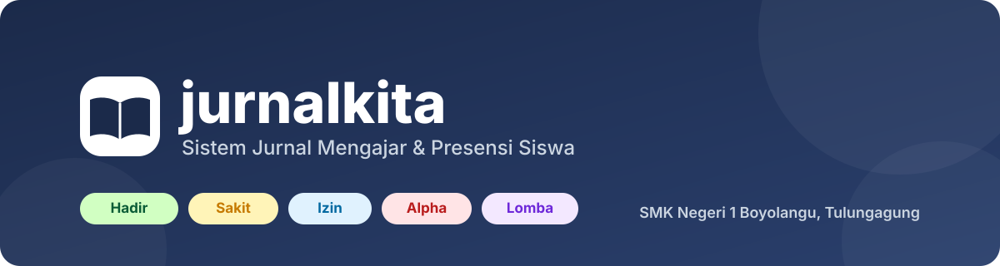

<br>


[](https://drive.google.com/drive/folders/1pFlESE6AGejzRO-shkvtrIPqYPVRQ1Oo)
[](docs/panduan-penggunaan.md)
[](#-memulai)

**[Tentang](#-tentang)** · **[Tampilan](#-tampilan-aplikasi)** · **[Fitur](#-fitur-utama)** · **[Peran](#-peran-pengguna)** · **[Memulai](#-memulai)** · **[Dokumentasi](#-dokumentasi)** · **[Tim](#-tim-pengembang)**

</div>

---

## 📖 Tentang

**jurnalkita** membantu sekolah mencatat kegiatan belajar mengajar secara rapi dan dapat dipantau. Guru mengisi jurnal setiap jam pelajaran, pengurus kelas memeriksanya, guru piket memantau kelas yang belum terisi, dan Waka memberi persetujuan izin siswa. Seluruh data dikelola Admin.

Tampilannya dirancang mobile first, karena sebagian besar pengguna membukanya lewat HP.

## 📸 Tampilan Aplikasi

> Semua tangkapan layar memakai data contoh dengan nama samaran.

<table>
  <tr>
    <td align="center" width="25%">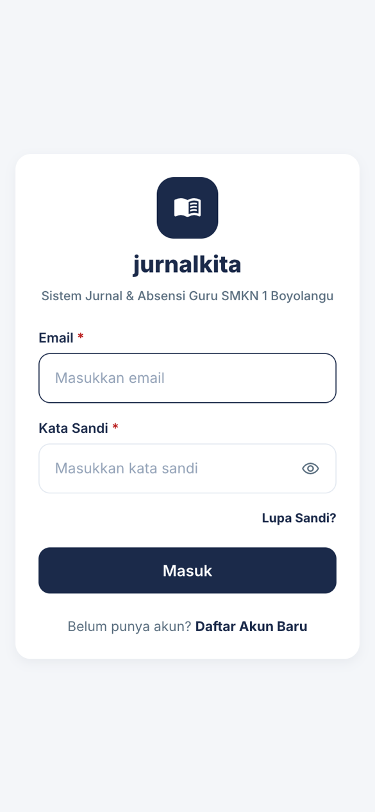<br><sub><b>Masuk</b></sub></td>
    <td align="center" width="25%">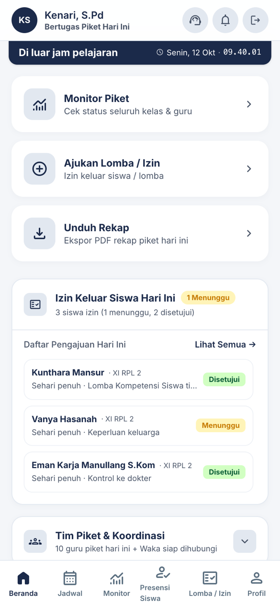<br><sub><b>Beranda Guru Piket</b></sub></td>
    <td align="center" width="25%">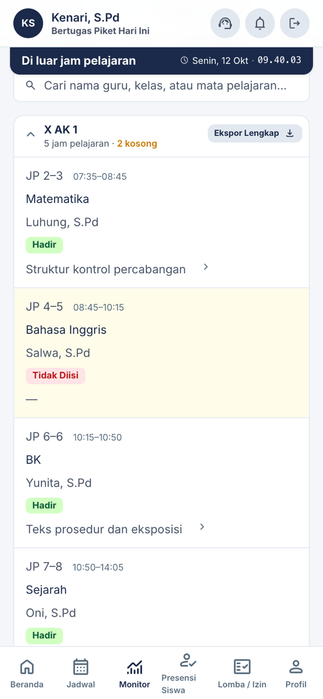<br><sub><b>Monitor Piket</b></sub></td>
    <td align="center" width="25%">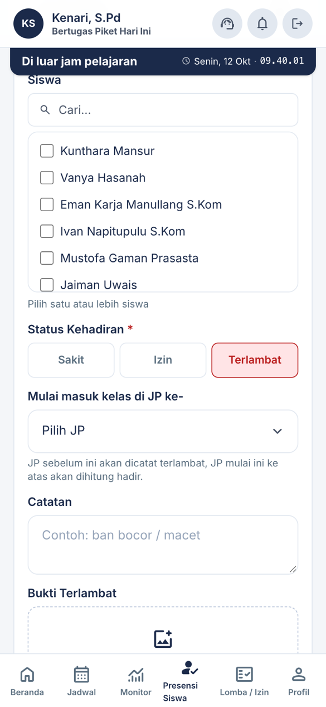<br><sub><b>Presensi Siswa</b></sub></td>
  </tr>
  <tr>
    <td align="center">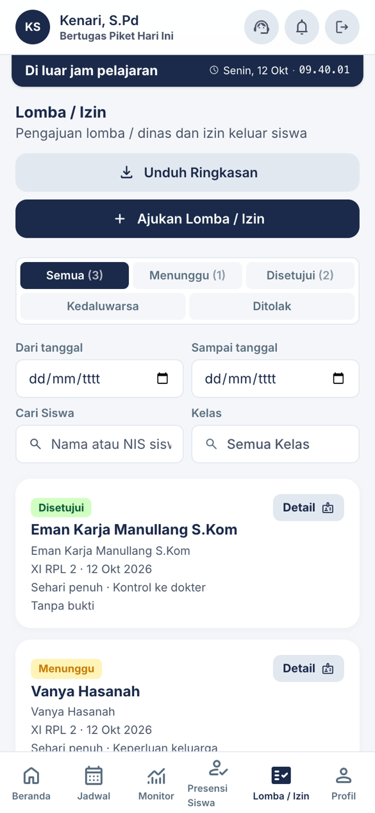<br><sub><b>Lomba / Izin</b></sub></td>
    <td align="center">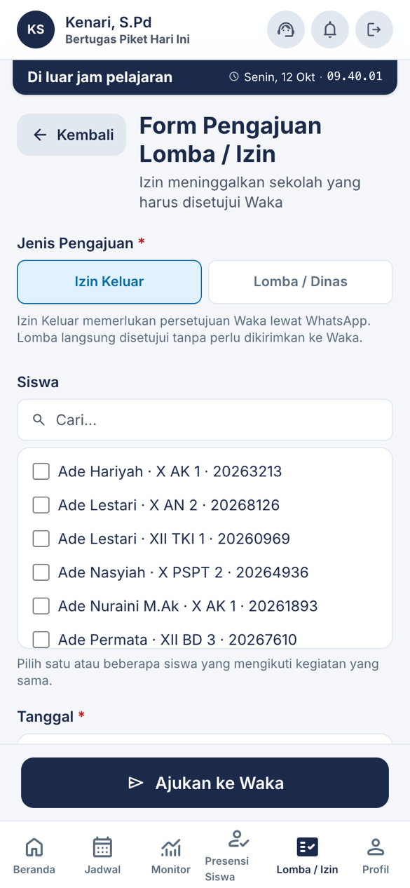<br><sub><b>Form Pengajuan</b></sub></td>
    <td align="center">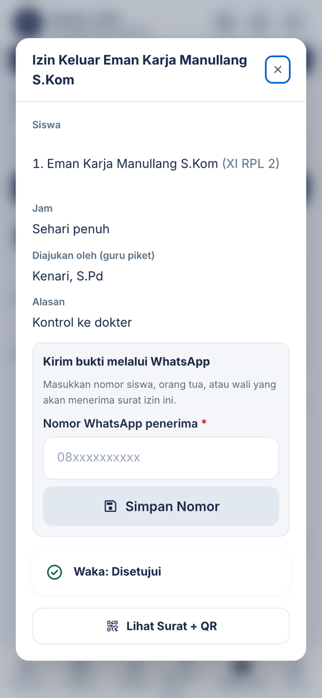<br><sub><b>Detail Pengajuan</b></sub></td>
    <td align="center">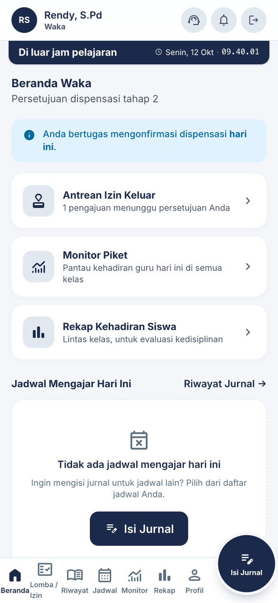<br><sub><b>Beranda Waka</b></sub></td>
  </tr>
</table>

<details>
<summary><b>Lihat tampilan peran lain</b></summary>
<br>

<table>
  <tr>
    <td align="center" width="30%">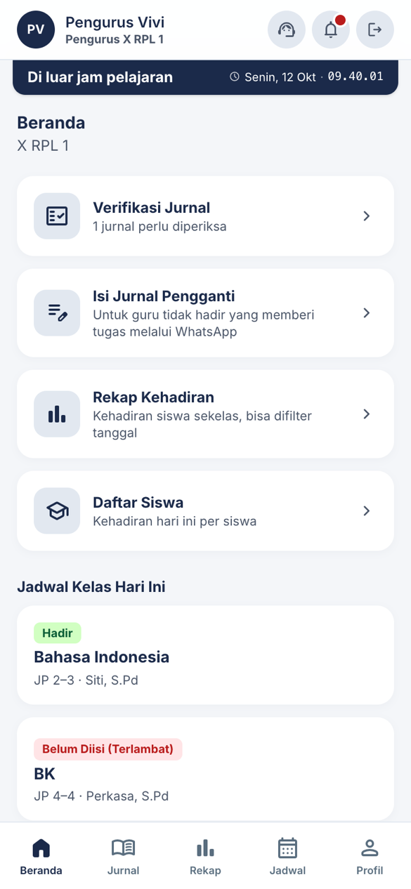<br><sub><b>Beranda Pengurus Kelas</b></sub></td>
    <td align="center" width="70%">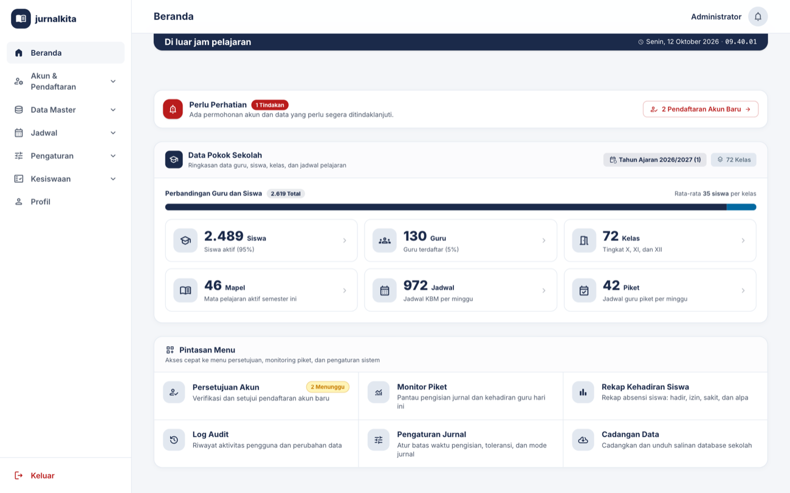<br><sub><b>Beranda Admin (desktop)</b></sub></td>
  </tr>
</table>

</details>

## ✨ Fitur Utama

| | Fitur | Keterangan |
|---|---|---|
| 📝 | **Jurnal & Presensi** | Materi, metode, presensi siswa, dan foto suasana kelas per jam pelajaran |
| ✅ | **Verifikasi Pengurus Kelas** | Pengurus kelas memeriksa jurnal yang diisi guru |
| 👁️ | **Monitor Piket** | Pantauan kehadiran guru per hari beserta status jurnal tiap jadwal, bisa diekspor ke PDF |
| 🩺 | **Presensi Siswa oleh Piket** | Mencatat siswa sakit, izin, dan terlambat, lalu disamakan ke semua jurnal kelas |
| 🏆 | **Lomba / Izin** | Pengajuan izin keluar dan lomba / dinas dengan persetujuan Waka lewat WhatsApp |
| 🔳 | **Surat + QR Berputar** | Surat izin dengan kode QR yang berganti tiap 10 detik, dipindai lewat kamera HP |
| 🔔 | **Notifikasi** | Pemberitahuan di dalam aplikasi untuk guru, piket, pengurus kelas, dan Waka |
| 📊 | **Rekap Kehadiran** | Rekap per siswa, kelas, dan mata pelajaran |
| 🎓 | **Tahun Ajaran & Kenaikan Kelas** | Kenaikan tingkat X → XI → XII, kelas XII lulus, data lama diarsipkan |
| 🧾 | **Audit Log** | Jejak aktivitas penting yang dapat ditelusuri Admin |

## 👥 Peran Pengguna

| Peran | Tugas utama |
|---|---|
| **Admin** | Mengelola akun, data master, jadwal, dan pengaturan |
| **Guru** | Mengisi jurnal mengajar dan presensi siswa |
| **Guru Piket** | Memantau kelas, mencatat presensi siswa, dan mengajukan izin keluar / lomba |
| **Wali Kelas** | Melihat rekap kehadiran dan jurnal kelas perwalian |
| **Waka** | Menyetujui atau menolak izin keluar dan memantau ketidakhadiran guru |
| **Pengurus Kelas** | Memeriksa jurnal kelasnya |

### Alur singkat izin keluar

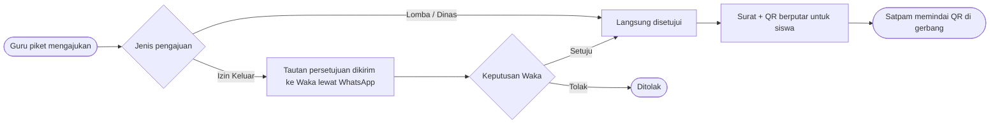

## 🚀 Memulai

Prasyarat: PHP 8.3 atau lebih baru, Composer, dan Node.js.

```bash
git clone https://github.com/rania-n/jurnalkita.git
cd jurnalkita
composer install
composer setup        # membuat .env, kunci aplikasi, database SQLite, migrasi + data contoh, dan build aset
php artisan serve
```

<details>
<summary><b>Jika <code>composer setup</code> gagal, jalankan secara manual</b></summary>

```bash
cp .env.example .env
php artisan key:generate
touch database/database.sqlite
php artisan migrate:fresh --seed
php artisan storage:link
npm install && npm run build
```

</details>

Saat pengembangan, jalankan `npm run dev` di terminal terpisah.

<details>
<summary><b>Menggunakan MySQL (bukan SQLite)</b></summary>

Ubah `.env`: `DB_CONNECTION=mysql`, isi `DB_DATABASE`, `DB_USERNAME`, dan `DB_PASSWORD`, buat databasenya, lalu jalankan `php artisan migrate:fresh --seed`.

</details>

<details>
<summary><b>Login gagal atau halaman galat?</b></summary>

Hampir selalu karena `.env` belum ada (`APP_KEY` kosong) atau database belum dimigrasi. Ulangi `composer setup`.

</details>

### 🔑 Akun Contoh

Kata sandi semua akun: `password`

| Email | Peran |
|---|---|
| `admin@jurnalkita.test` | Admin |
| `waka@jurnalkita.test` | Waka |
| `winartin@jurnalkita.test` | Guru (juga mendapat jadwal piket, hari Senin) |
| `guru.biasa@jurnalkita.test` | Guru tanpa jadwal piket |
| `guru.piket@jurnalkita.test` | Guru piket (jadwal dipasang pada hari seeder dijalankan) |
| `kelas1@jurnalkita.test` | Pengurus kelas |

### 🧪 Pengujian & Format Kode

```bash
php artisan test
vendor/bin/pint
```

## 📚 Dokumentasi

| Dokumen | Isi |
|---|---|
| [Drive Penggunaan](https://drive.google.com/drive/folders/1pFlESE6AGejzRO-shkvtrIPqYPVRQ1Oo) | Materi penggunaan aplikasi |
| [`docs/panduan-penggunaan.md`](docs/panduan-penggunaan.md) | Panduan per peran |
| [`docs/spec.md`](docs/spec.md) | Aturan alur detail |
| [`docs/scope.md`](docs/scope.md) | Cakupan fitur dan rencana berikutnya |
| [`docs/roadmap.md`](docs/roadmap.md) | Rencana dan pembagian modul |
| [`docs/halaman.md`](docs/halaman.md) | Daftar halaman |

## 🤝 Tim Pengembang

Proyek **Collaboration SMK**, **Kelas XI RPL 2, Semester 1**
SMK Negeri 1 Boyolangu, Tulungagung.

- **Rania**
- **Fitra**
- **Zahwa**
- **Vara**
- **Dude**

---

<div align="center">

Dibuat oleh siswa **XI RPL 2** · SMK Negeri 1 Boyolangu, Tulungagung

</div>
