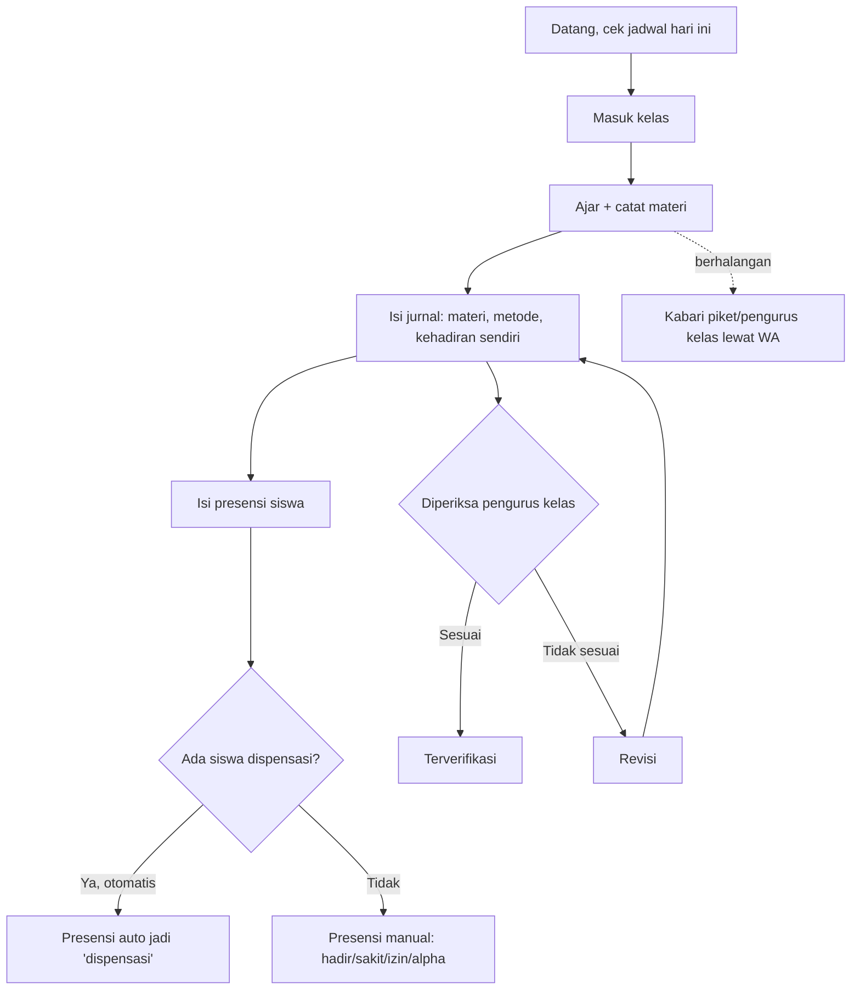
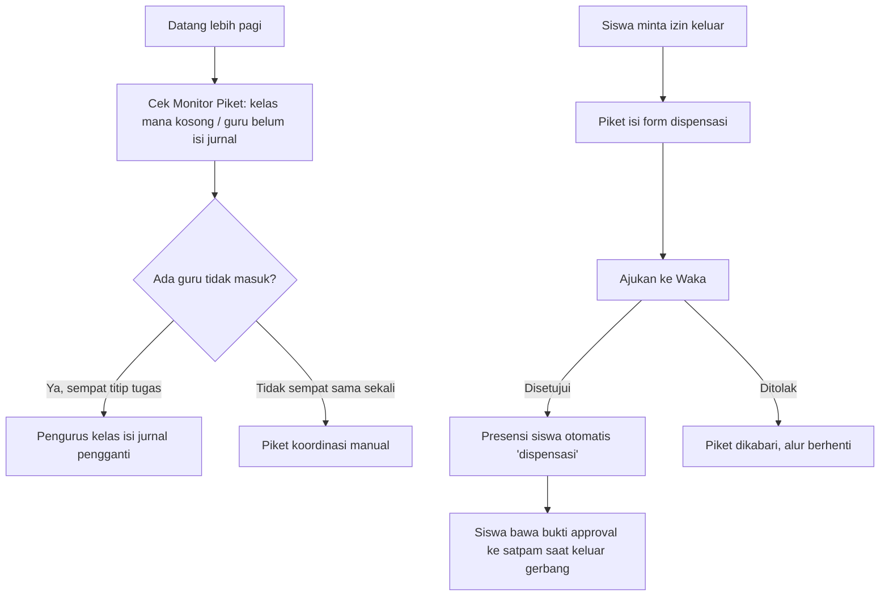
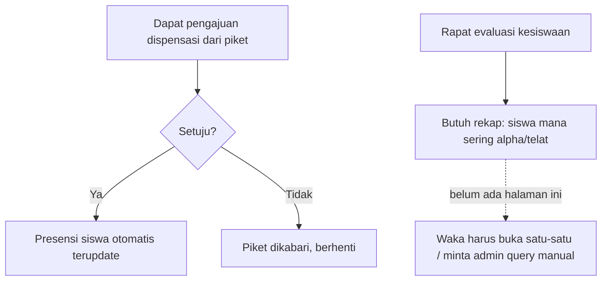
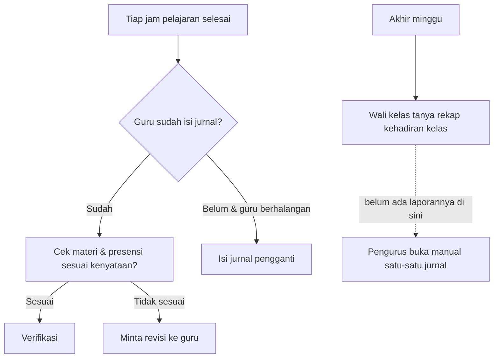
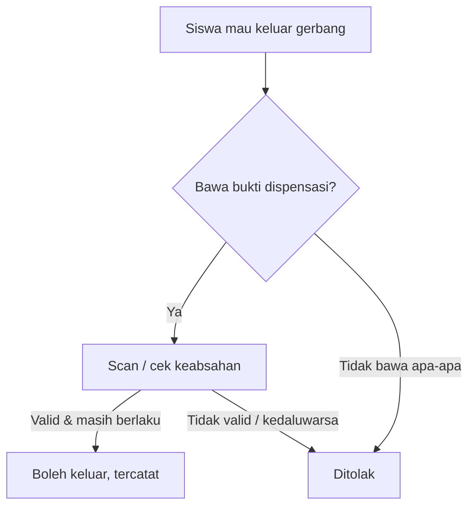
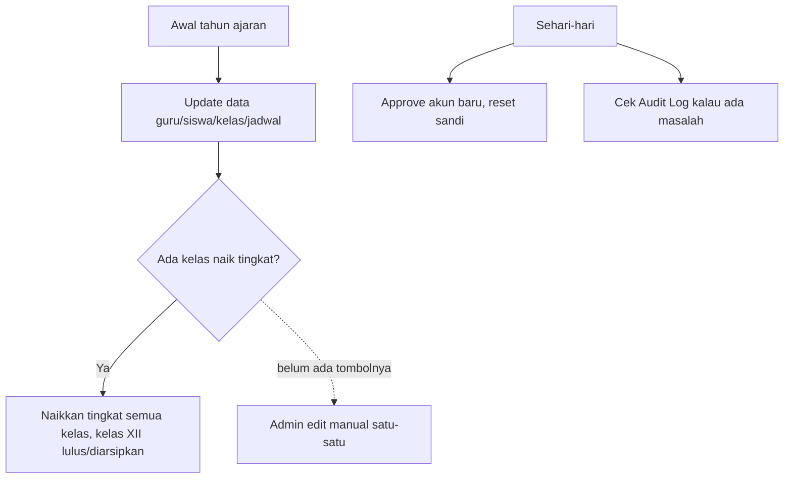

# Alur Kerja per Peran & Analisis Kebutuhan

Dokumen ini buat bantu kamu **memutuskan** fitur mana yang beneran perlu, bukan daftar
tugas baru. Isinya: alur kerja nyata tiap peran di sekolah (dari pengalaman umum SMK di
Indonesia) → dicocokkan sama yang sudah ada di jurnalkita → ketahuan mana yang beneran
bolong.

**Batasan penting**: jurnalkita itu **sistem jurnal & absensi guru**, bukan SIM Sekolah
lengkap. Hal-hal seperti nilai/rapor, RPP/silabus, keuangan/SPP, PPDB, atau
perpustakaan **sengaja tidak dibahas di sini** — itu aplikasi lain. Yang dibahas cuma
yang nyambung ke: jurnal mengajar, presensi siswa, dispensasi, piket, dan akun.

Kode status: ✅ sudah ada · 🔨 backlog (sudah dirancang) · 🆕 **baru ketahuan dari
analisis ini** · 🚫 di luar scope aplikasi ini (dicatat biar sadar, bukan berarti harus
dibikin)

---

## 1. Guru Mata Pelajaran

| Langkah nyata | Status jurnalkita |
|---|---|
| Lihat jadwal mengajar (harian & mingguan) | ✅ |
| Isi jurnal — tanggal & jam otomatis, terkunci ke jam sekarang | ✅ |
| Presensi siswa, auto-dispensasi, catatan per siswa | ✅ |
| Upload foto bukti mengajar | ✅ |
| Riwayat jurnal + hapus kalau salah (selama belum diverifikasi) | ✅ |
| Diminta revisi oleh pengurus kelas → perbaiki → antre lagi | ✅ |
| **Dikasih tahu otomatis kalau ada revisi/dispensasi baru** | 🔨 (notifikasi, sudah dirancang) |
| **Rekap kehadiran mengajar sendiri (buat bukti kinerja/BKD)** | 🆕 belum ada sama sekali |
| Nilai, RPP, bank soal | 🚫 di luar scope |

---

## 2. Guru Piket

| Langkah nyata | Status jurnalkita |
|---|---|
| Keliling cek kelas mana yang kosong | ✅ **Monitor Piket** — gantiin ini persis, per hari, per kelas/guru |
| Ajukan dispensasi siswa | ✅ |
| Batalkan pengajuan salah input | ✅ |
| Ekspor rekap hari itu (ringkas & lengkap per kelas/guru) | ✅ |
| **Kabar status dispensasi otomatis (disetujui/ditolak)** | 🔨 (notifikasi) |
| **Kirim link approval ke Waka lewat WA (Waka jarang buka web)** | 🔨 (link `wa.me`, sudah dirancang) |
| **Cetak/tunjukkan bukti izin ke satpam saat siswa keluar gerbang** | 🔨 (surat + QR — kamu bilang **wajib**) |
| Catatan siswa telat masuk sekolah pagi (bukan soal jam pelajaran) | 🆕 lihat catatan di bagian bawah — **beda konsep** dari absensi per-jurnal |
| BK / poin pelanggaran berat | 🚫 biasanya sistem BK terpisah |

---

## 3. Waka Kesiswaan

| Langkah nyata | Status jurnalkita |
|---|---|
| Setujui/tolak dispensasi | ✅ |
| Lihat Monitor Piket (kondisi hari itu, semua kelas) | ✅ |
| Ekspor laporan dispensasi | ✅ |
| Rekap kedisiplinan per siswa lintas waktu, lintas kelas (siapa yang alpha berkali-kali) | ✅ `/rekap/siswa` — ada tanda peringatan otomatis kalau alpha ≥3x |
| **No. HP Waka buat kirim link WA** | 🔨 belum ada kolomnya di akun |
| Surat Peringatan (SP1/SP2/SP3), panggil orang tua | 🚫 proses BK, belum diminta dijadikan fitur |

---

## 4. Pengurus Kelas (Sekretaris Kelas)

| Langkah nyata | Status jurnalkita |
|---|---|
| Lihat jurnal kelasnya, verifikasi / minta revisi | ✅ |
| Isi jurnal pengganti (guru titip tugas) | ✅ |
| Lihat daftar siswa sekelas | ✅ (V1) |
| Lihat jadwal pelajaran kelas seminggu | ✅ (V2) |
| Rekap kehadiran kelasnya sendiri (buat lapor ke wali kelas) | ✅ `/sekretaris/rekap` |
| Piket kebersihan kelas | 🚫 tidak relevan ke sistem ini |

---

## 5. Satpam

| Langkah nyata | Status jurnalkita |
|---|---|
| Verifikasi siswa yang izin keluar | 🔨 **belum ada peran ini sama sekali** — kamu bilang **wajib** |
| Scan QR dari surat dispensasi | 🔨 sama, satu paket sama surat dispensasi |
| Catat siapa keluar-masuk & jam berapa | 🔨 otomatis kebentuk dari hasil scan |
| Tamu / kendaraan keluar-masuk | 🚫 di luar scope dispensasi siswa |

> Ini satu-satunya peran yang **betul-betul kosong** dari nol — bukan salah desain,
> memang belum pernah dibangun. Wajar kerasa "kurang".

---

## 6. Admin

| Langkah nyata | Status jurnalkita |
|---|---|
| CRUD semua data master | ✅ |
| Approve/tolak akun, buat akun, reset sandi, **hapus akun** | ✅ |
| Audit log (siapa ngapain) | ✅ **baru selesai digabung** |
| **Tahun ajaran aktif + proses kenaikan kelas** | 🔨 kamu bilang **wajib** |
| Surat-menyurat resmi sekolah, kearsipan, SPP | 🚫 di luar scope |

---

## Ringkasan — apa yang *beneran* baru ketahuan

Dari 6 alur di atas, ada **3 kebutuhan nyata yang belum pernah tercatat sebelumnya**
(bukan yang kamu sudah tahu dari sebelumnya):

| # | Temuan | Kenapa kerasa penting | Perkiraan effort |
|---|---|---|---|
| N1 | ✅ **selesai** — Rekap kehadiran per siswa (Waka: lintas kelas · Pengurus Kelas: kelasnya sendiri) | Datanya **sudah ada** (tabel `absensis`), yang belum cuma laporannya | Selesai — `/rekap/siswa` (Waka+Admin) & `/sekretaris/rekap` |
| N2 | **Rekap jurnal per guru** (portofolio mengajar per semester) | Guru sering diminta bukti mengajar. Bukan buat sidang minggu ini, tapi murah kalau mau ditambah | Kecil, ±2-3 jam |
| N3 | **"Buku piket" ketertiban** (siswa telat gerbang pagi, dll) | **Beda konsep** dari absensi per jam pelajaran yang sudah ada — ini soal siswa telat *masuk sekolah*, bukan telat di kelas. Perlu tabel baru | Sedang — butuh keputusan dulu: mau digabung ke sistem ini atau bukan? |

## Rekomendasi keputusan

**N1 (rekap per siswa)** — saran aku: **tambahkan minggu ini**, sebelum yang lain di
backlog. Alasannya sama kayak Monitor Piket kemarin: datanya sudah lengkap di database,
efeknya besar (langsung kejawab kebutuhan Waka *dan* pengurus kelas sekaligus, dua peran
sekaligus dari satu fitur), dan risikonya rendah (cuma baca data, tidak mengubah apa-apa
yang sudah jalan).

**N2 (rekap per guru)** — boleh nanti, dampaknya kecil buat sidang minggu ini.

**N3 (buku piket ketertiban)** — ini **butuh kamu putuskan dulu**, bukan aku yang
nentuin: apakah guru pembimbing benar-benar minta ini masuk jurnalkita, atau itu memang
urusan lain (misal sudah ada sistem/buku manual terpisah di sekolah)? Kalau bukan
permintaan eksplisit, jangan dikerjakan — ini gampang jadi lubang scope creep.

**Yang sudah disepakati sebelumnya tetap prioritas** (dari `docs/scope.md`): Surat
Dispensasi + QR + Satpam, WhatsApp (versi link), Tahun Ajaran/Kenaikan Kelas — tiga ini
tetap yang **wajib** menurut guru pembimbingmu, N1–N3 cuma tambahan temuan dari analisis
ini, bukan pengganti.

---

## Update — koreksi & tambahan dari guru pembimbing (setelah analisis ini ditulis)

1. **Guru piket TIDAK mengajar selama shift-nya, dan piket dibagi per shift** (bukan
   sehari penuh). Sudah diperbaiki: admin sekarang **ditolak** kalau mencoba menjadwalkan
   guru mengajar di jam yang bentrok sama shift piketnya. Monitor Piket juga menampilkan
   roster "Petugas Piket Hari Ini" (nama + jam shift).
2. **Ide Fitra**: admin dapat visibilitas ke dunia Waka (dispensasi, Monitor Piket, rekap
   siswa) — **sudah dikerjakan**. Admin bisa **lihat** ketiganya (plus 3 kartu ringkasan
   di dashboard admin), tapi **tidak bisa approve/tolak** — itu tetap wewenang piket/Waka.
   Ini masuk akal: admin butuh gambaran umum buat troubleshooting/pengawasan, bukan buat
   menjalankan tugas kesiswaan sehari-hari.
